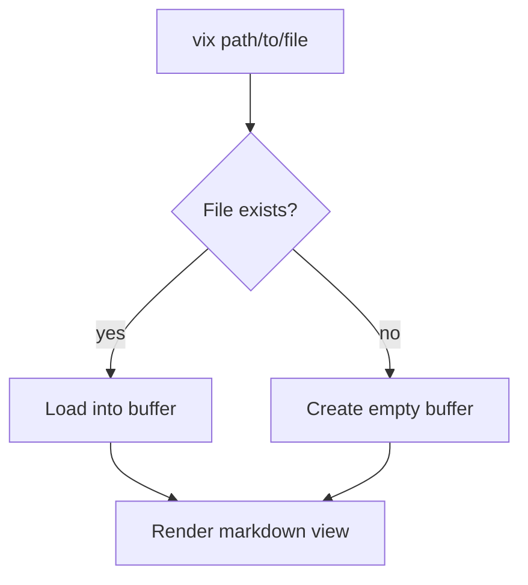
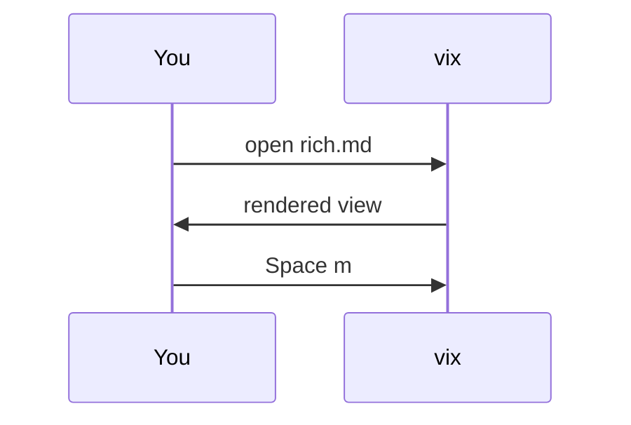

# Rich Markdown Showcase

A single document exercising most of the elements vix's rendered markdown
view understands. Open it in vix and press `Space m` to toggle between this
raw source and the rendered view.

## Text formatting

A paragraph with **bold**, *italic*, ~~strikethrough~~, and `inline code`
all in one sentence, plus a [named link](https://example.com/vix) and a
bare autolink at <https://example.com>.

This line ends with a hard break,\
and this is the next line of the same paragraph.

### Lists

Nested bullets, three levels deep:

- Motions
  - Word motions
    - `w` / `b` / `e`
  - Line motions
    - `0` / `^` / `$`
- Operators
  - `d` / `c` / `y`
  - `<` / `>` indent

An ordered list:

1. Clone the repo
2. `cargo build --release`
3. Drop the binary on `$PATH`

A task list:

- [x] Ship the rendered markdown view
- [x] Write the fixture
- [ ] Write the tests

#### Quoting

> A blockquote holding a nested quote:
>
> > Turtles all the way down.

##### Code

A fenced Rust block:

```rust
fn greet(name: &str) -> String {
    format!("hello, {name}")
}
```

An indented block (four-space, no fence):

    $ vix tests/fixtures/rich.md
    opens rendered by default

An unknown-language fence:

```wat
(module (func $add (param i32 i32) (result i32)))
```

##### Diagrams

Fenced ```mermaid blocks render as Unicode box-drawing diagrams instead of
plain code, via the `mermaid-text` crate. A flowchart of vix opening a file:



And a sequence diagram of the toggle round-trip:



###### Tables

| Feature       |   Default    |             Toggle |
| :------------ | :----------: | ------------------: |
| Rendered view | on for `.md` |             `Space m` |
| Raw view      |     off      |                `:raw` |
| Preview       |      —       |   `:preview` / `:pv` |

---

A horizontal rule sits above this paragraph, and another one sits below.

---

An image reference: 

A footnote reference lands here[^1].

[^1]: The footnote definition, tucked at the bottom of the document.
